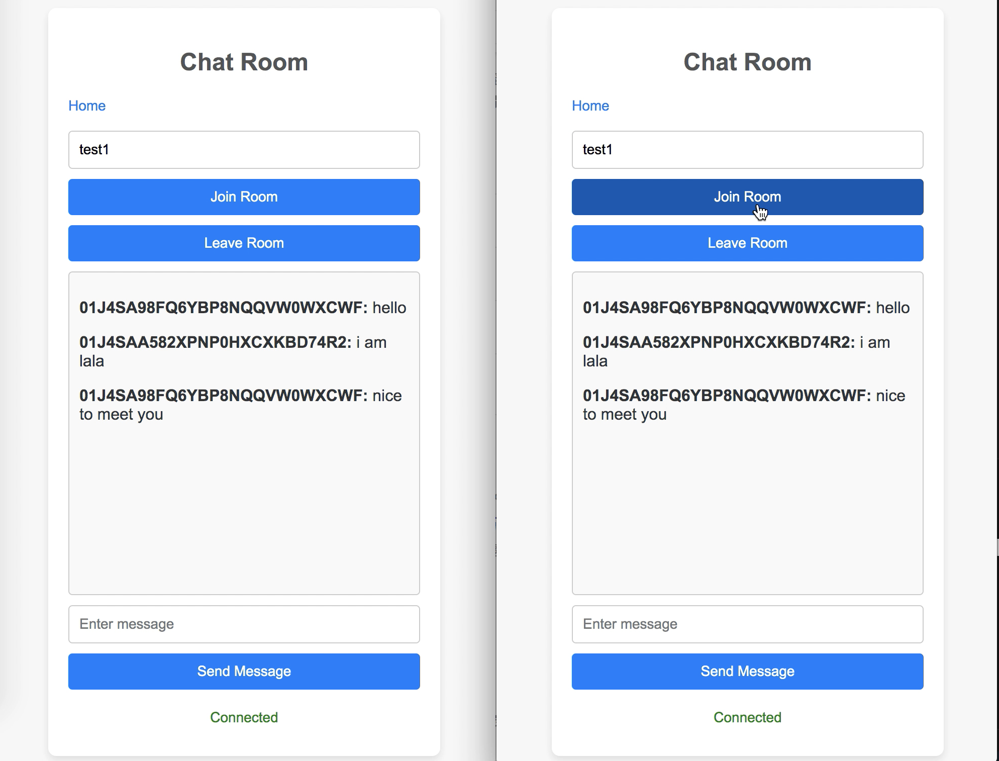

# Go Social Media
## Descriptions
Go Chat App is a project for learning technologies about realtime chat room:
- create user accounts.
- login verify with jwt.
- logger middleware.
- realtime online chat with redis stream in fan-in pattern.

TODO: 
- refine code.
- api doc + complete api.
- proper error handling.
- sticky session when scalling service + load balancer.
- persist chat messages to the database.
- distribute id in redis with snowflake.
- using message broker in a fan-out pattern for storing messages and avoid hot key.
- image upload and thumbnails handing.


## Setup
1. add host name
```sh
sudo vim /etc/hosts

# add below to file
127.0.0.1	gsm-dev
```

run `docker-compose up` to start the go-chat app

2. visit
```
http://gsm-dev/
```

3. display

[](./static/image/chat-room.png)

[](./static/video/go-chat-room-display-720p.mov)
