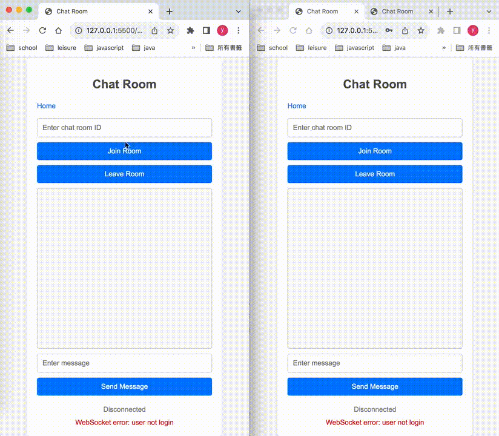

# Go Chat Room

## Descriptions
The system is built on Golang, Nginx, WebSocket, Redis, and MongoDB to implement scalable WebSocket microservices.

Basic flow: register and create an account, connect to the service using the WebSocket protocol, and enter a chat room ID or name to join the chat room for real-time chatting among multiple users.

---
Architecture


[](./static/image/chat-room.png)


TODO:
- refine code.
- api doc + complete api.
- proper error handling.
- persist chat messages to the database.
- distribute id in redis with snowflake.
- using message broker in a fan-out pattern for storing messages and avoid hot key.
- image upload and thumbnails handing.


## Setup
1. Add host name
    ```sh
    sudo vim /etc/hosts

    # add below to file
    127.0.0.1	gsm-dev
    ```

2. start services

    run `docker-compose up` to start the go-chat app, now you can visit `http://gsm-dev/index.html`


### API
#### account service
Endpoint: POST `http://gsm-dev/api/account/v1/user`
```json
{
  "name": "test1",
  "email": "test1@gmail.com",
  "password": "test1"
}
```
Endpoint: POST  `http://gsm-dev/api/account/v1/auth/login`
```json
{
  "email": "test1@gmail.com",
  "password": "test1"
}
```

#### realtime service
Endpoint: `ws://gsm-dev/api/realtime/v1/chatroom/stream?access_token=${encodedToken}`

```json
// join chat room
{"type":"CHAT_ROOM_ACTION","payload":{"action":"JOIN_CHAT_ROOM","room_id":"test1"}}

// chat message
{"type":"CHAT","payload":{"room_id":"test1","action":"CHAT_ROOM_MESSAGE","chat":"hhh"}}

// leave chatroom
{"type":"CHAT_ROOM_ACTION","payload":{"action":"LEAVE_CHAT_ROOM","room_id":"test1"}}
```

## Display

[](./static/video/go-chat-room-display-720p.gif)
